# Sistema de Gestión de Biblioteca Lumina

Sistema web de gestión bibliotecaria desarrollado en PHP con MySQL, que permite la administración de libros, usuarios y préstamos con diferentes roles de acceso.

## Tabla de Contenidos

- [Características](#características)
- [Tecnologías Utilizadas](#tecnologías-utilizadas)
- [Requisitos Previos](#requisitos-previos)
- [Instalación](#instalación)
- [Configuración de la Base de Datos](#configuración-de-la-base-de-datos)
- [Estructura del Proyecto](#estructura-del-proyecto)
- [Roles y Funcionalidades](#roles-y-funcionalidades)
- [Usuarios de Prueba](#usuarios-de-prueba)
- [Capturas de Pantalla](#capturas-de-pantalla)
- [Uso del Sistema](#uso-del-sistema)

## Características

- Sistema de autenticación con roles (Administrador, Docente, Estudiante)
- Gestión completa de libros (CRUD)
- Sistema de préstamos y devoluciones
- Notificaciones por correo electrónico usando PHPMailer
- Generación de reportes visuales
- Catálogo de libros con búsqueda y filtros
- Historial de préstamos por usuario
- Dashboard personalizado según el rol
- Gestión de usuarios (solo para administradores)

## Tecnologías Utilizadas

- **Backend:** PHP 7.4+
- **Base de Datos:** MySQL
- **Servidor Local:** XAMPP (Apache + MySQL)
- **Librerías:**
  - PHPMailer 6.10 (Envío de correos)
  - PDO (Capa de abstracción de base de datos)
- **Frontend:**
  - HTML5
  - CSS3
  - JavaScript
  - Font Awesome 6.0 (Iconos)

## Requisitos Previos

- XAMPP instalado (incluye Apache y MySQL)
- PHP 7.4 o superior
- Composer (para instalar dependencias)
- Navegador web moderno

## Instalación

### 1. Clonar el repositorio

```bash
git clone <URL-del-repositorio>
```

### 2. Mover el proyecto a la carpeta de XAMPP

Copiar la carpeta del proyecto a `C:\xampp\htdocs\PW`

### 3. Instalar dependencias con Composer

Abrir una terminal en la carpeta del proyecto y ejecutar:

```bash
composer install
```

Esto instalará PHPMailer y otras dependencias necesarias.

### 4. Iniciar servicios de XAMPP

- Abrir el panel de control de XAMPP
- Iniciar el servicio **Apache**
- Iniciar el servicio **MySQL**

## Configuración de la Base de Datos

### 1. Crear la base de datos

1. Acceder a phpMyAdmin: `http://localhost/phpmyadmin`
2. Crear una nueva base de datos llamada `pw`
3. Importar el script SQL ubicado en la carpeta `bd/` (el archivo que contiene la estructura y datos iniciales)

### 2. Configurar la conexión

La configuración de conexión está en `orm/dataBase.php`:

```php
$dns = "mysql:host=localhost;port=3306;dbname=pw";
$user = "root";
$password = "";
```

Si tu instalación de MySQL usa un puerto diferente, modificar el parámetro `port`.

### 3. Verificar estructura de tablas

El script de base de datos debe crear las siguientes tablas:
- `usuarios` - Información de usuarios del sistema
- `libros` - Catálogo de libros
- `prestamos` - Registro de préstamos
- Y otras tablas relacionadas

## Estructura del Proyecto

```
PW/
├── administrador/          # Módulo de administración
│   ├── index_admin.php    # Dashboard del administrador
│   ├── agregar.php        # Agregar libros
│   ├── usuarios.php       # Gestión de usuarios
│   ├── prestar_libro.php  # Gestión de préstamos
│   ├── Reportes.php       # Generación de reportes
│   └── ...
├── docente/               # Módulo para docentes
│   ├── index_docente.php  # Dashboard del docente
│   ├── catalogo.php       # Catálogo de libros
│   ├── mis_prestamos.php  # Préstamos activos
│   ├── historial.php      # Historial de préstamos
│   └── ...
├── estudiante/            # Módulo para estudiantes
│   ├── index_estudiante.php
│   ├── catalogo.php
│   ├── mis_prestamos.php
│   └── ...
├── maestras/              # Plantillas y componentes compartidos
│   └── Includes/
│       ├── header.php     # Encabezado común
│       ├── footer.php     # Pie de página
│       ├── nav_admin.php  # Navegación del admin
│       ├── nav_docente.php
│       ├── nav_estudiante.php
│       └── auth.php       # Sistema de autenticación
├── orm/                   # Capa de acceso a datos
│   ├── dataBase.php       # Conexión a BD
│   ├── usuario.php        # Modelo de usuario
│   ├── libro.php          # Modelo de libro
│   ├── prestamo.php       # Modelo de préstamo
│   └── email.php          # Envío de correos
├── css/                   # Hojas de estilo
│   ├── login.css
│   ├── index.css
│   ├── header.css
│   └── ...
├── bd/                    # Scripts de base de datos
│   └── [script.sql]       # Script de inicialización
├── vendor/                # Dependencias de Composer
├── login.php              # Página de inicio de sesión
├── registro.php           # Registro de nuevos usuarios
└── composer.json          # Configuración de dependencias
```

## Roles y Funcionalidades

### Administrador

El administrador tiene acceso completo al sistema:

- Gestión de libros (crear, editar, eliminar)
- Gestión de usuarios (ver, crear, editar, eliminar)
- Administración de préstamos (aprobar, rechazar, renovar)
- Visualización de estadísticas generales
- Generación de reportes visuales
- Ver todos los préstamos del sistema

### Docente

Los docentes tienen permisos para:

- Ver catálogo completo de libros
- Solicitar préstamos (hasta 3 libros simultáneos)
- Ver sus préstamos activos
- Consultar historial de préstamos
- Renovar préstamos (si están habilitados)
- Acceso a su dashboard personalizado

### Estudiante

Los estudiantes pueden:

- Explorar catálogo de libros
- Solicitar préstamos (hasta 3 libros simultáneos)
- Ver préstamos activos
- Consultar historial personal
- Dashboard con estadísticas personales

## Usuarios de Prueba

Para probar el sistema, usar las siguientes credenciales:

| Rol | Usuario | Contraseña |
|-----|---------|-----------|
| Administrador | `admin` | `admin123` |
| Docente | `amartinez` | `docente123` |
| Estudiante | `jperez` | `estudiante123` |

## Capturas de Pantalla

### 1. Pantalla de Login

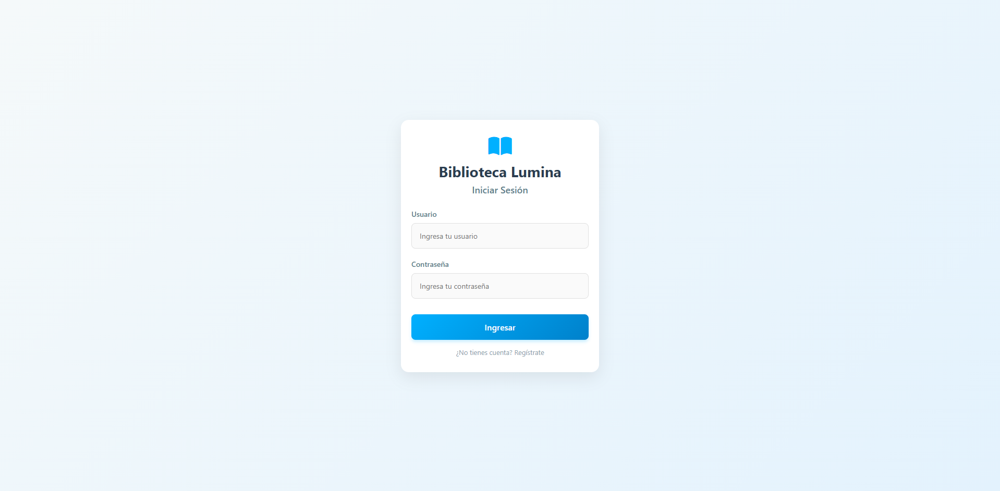

*Pantalla de inicio de sesión del sistema*

---

### 2. Dashboard - Rol Administrador

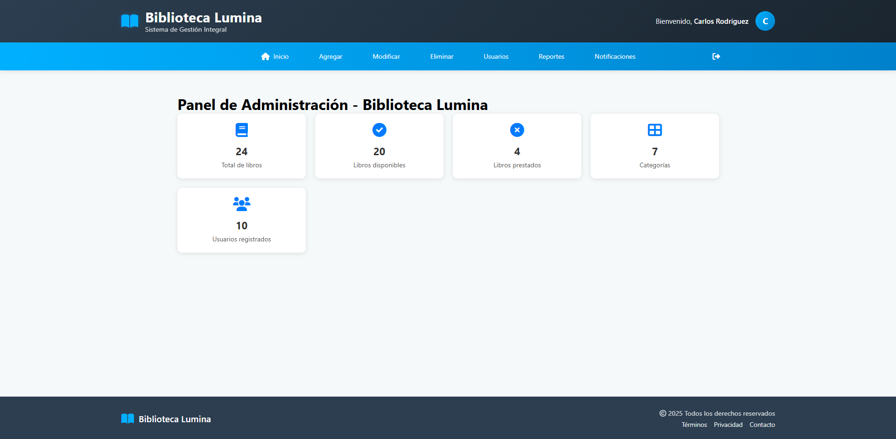

*Panel de control del administrador con estadísticas generales*

---

### 3. Gestión de Libros (Administrador)

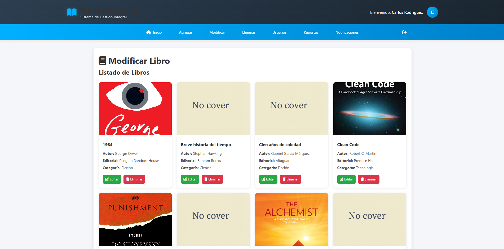

*Módulo para agregar, editar y eliminar libros del catálogo*

---

### 4. Gestión de Usuarios (Administrador)

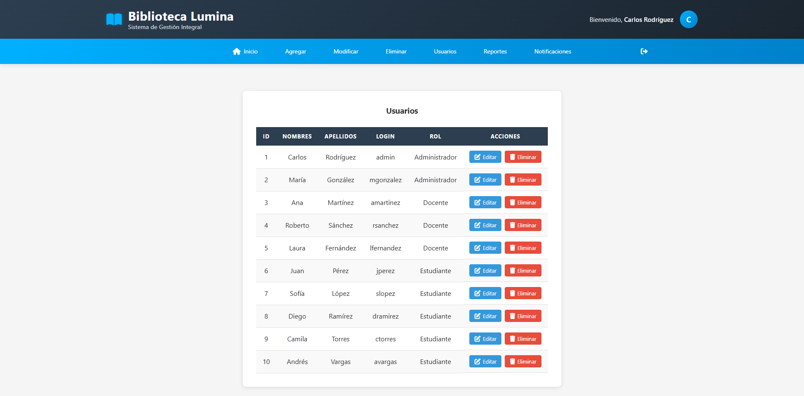

*Administración de usuarios del sistema*

---

### 5. Reportes (Administrador)

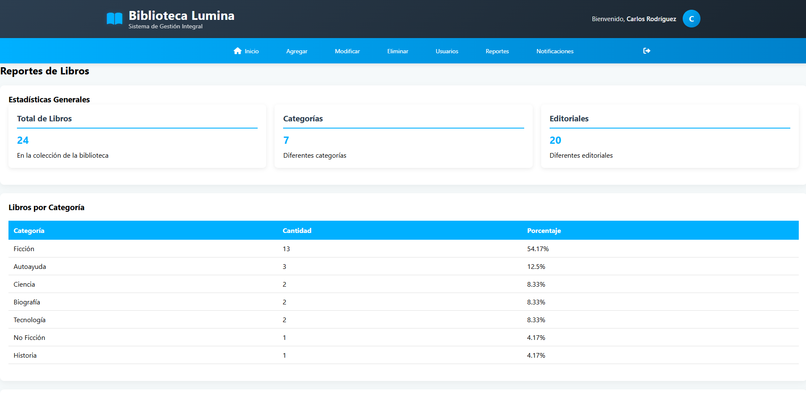

*Visualización de reportes y estadísticas del sistema*

---

### 6. Dashboard - Rol Docente

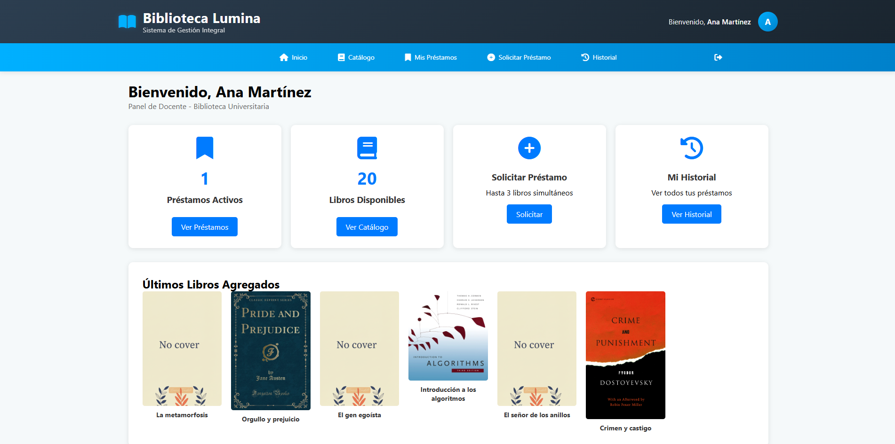

*Panel personalizado para docentes con estadísticas de préstamos*

---

### 7. Catálogo de Libros (Docente/Estudiante)

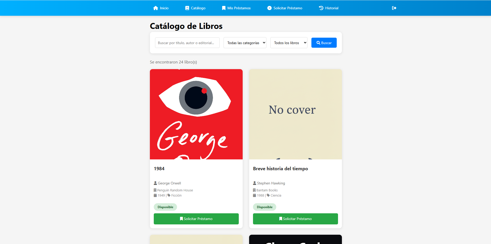

*Vista del catálogo completo de libros disponibles*

---

### 8. Mis Préstamos Activos

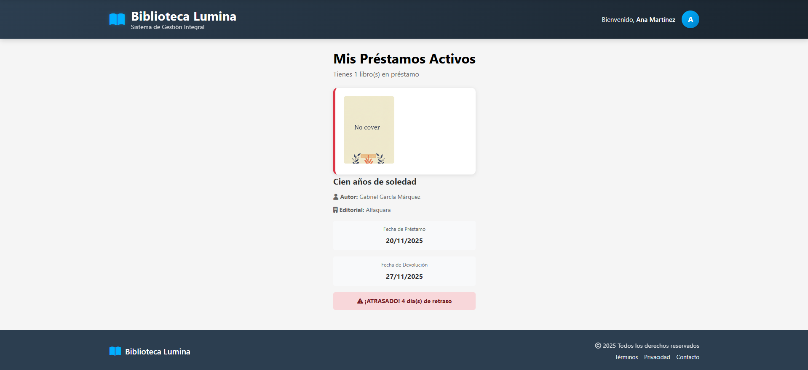

*Vista de préstamos activos del usuario*

---

### 9. Historial de Préstamos

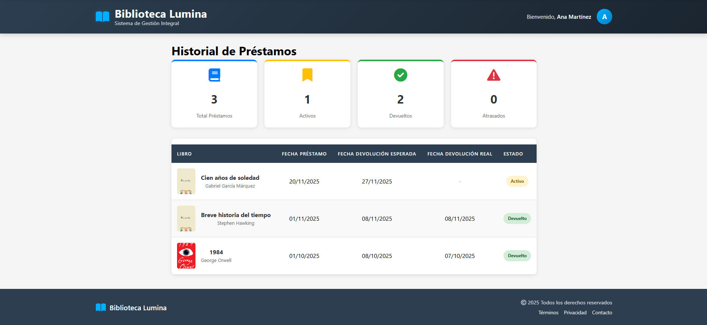

*Historial completo de préstamos realizados*

---

### 10. Solicitar Préstamo

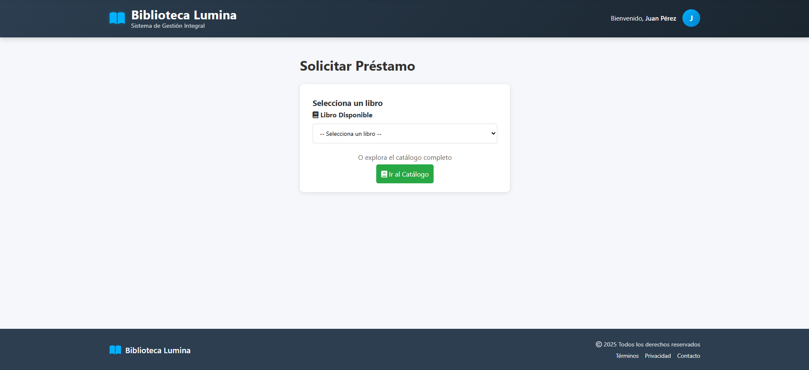

*Interfaz para solicitar préstamo de libros*

---

### 11. Dashboard - Rol Estudiante

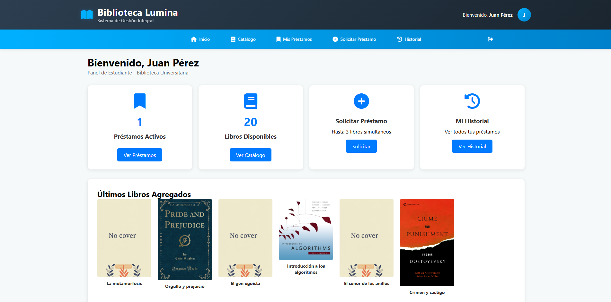

*Panel personalizado para estudiantes*

---

## Uso del Sistema

### 1. Acceso al Sistema

1. Abrir el navegador y acceder a: `http://localhost/PW/login.php`
2. Ingresar con uno de los usuarios de prueba
3. El sistema redirigirá al dashboard correspondiente según el rol

### 2. Flujo de Préstamo

**Para Estudiantes/Docentes:**
1. Navegar a "Catálogo" desde el menú
2. Buscar el libro deseado
3. Hacer clic en "Solicitar Préstamo"
4. Esperar aprobación del administrador
5. Recibir notificación por correo

**Para Administrador:**
1. Revisar solicitudes en "Préstamos"
2. Aprobar o rechazar solicitudes
3. El sistema envía notificación automática al usuario
4. Gestionar devoluciones cuando corresponda

### 3. Gestión de Libros (Solo Administrador)

1. Ir a "Libros" en el menú
2. Hacer clic en "Agregar Libro"
3. Completar formulario (título, autor, categoría, etc.)
4. Subir imagen de portada (opcional)
5. Guardar

### 4. Visualizar Reportes (Administrador)

1. Acceder a "Reportes"
2. Seleccionar tipo de reporte
3. Elegir rango de fechas (si aplica)
4. Visualizar estadísticas y datos

## Notas Importantes

- Los préstamos están limitados a 3 libros por usuario simultáneamente
- El sistema envía notificaciones automáticas por email cuando se aprueba/rechaza un préstamo
- Las contraseñas están hasheadas en la base de datos
- Se recomienda cambiar las contraseñas de prueba en producción
- El puerto por defecto de MySQL es 3306, modificar en `orm/dataBase.php` si es diferente

## Solución de Problemas

### Error de conexión a la base de datos

- Verificar que MySQL esté iniciado en XAMPP
- Comprobar que la base de datos `pw` exista
- Revisar credenciales en `orm/dataBase.php`
- Verificar el puerto de MySQL (3306 por defecto)

### No se envían correos

- Configurar SMTP en `orm/email.php`
- Verificar credenciales de correo
- Comprobar que PHPMailer esté instalado

### Errores de permisos

- Verificar que la carpeta tenga permisos de escritura
- Revisar que Apache tenga permisos sobre la carpeta del proyecto

## Licencia

Este proyecto es para fines educativos.

---

**Biblioteca Lumina** - Sistema de Gestión Bibliotecaria
